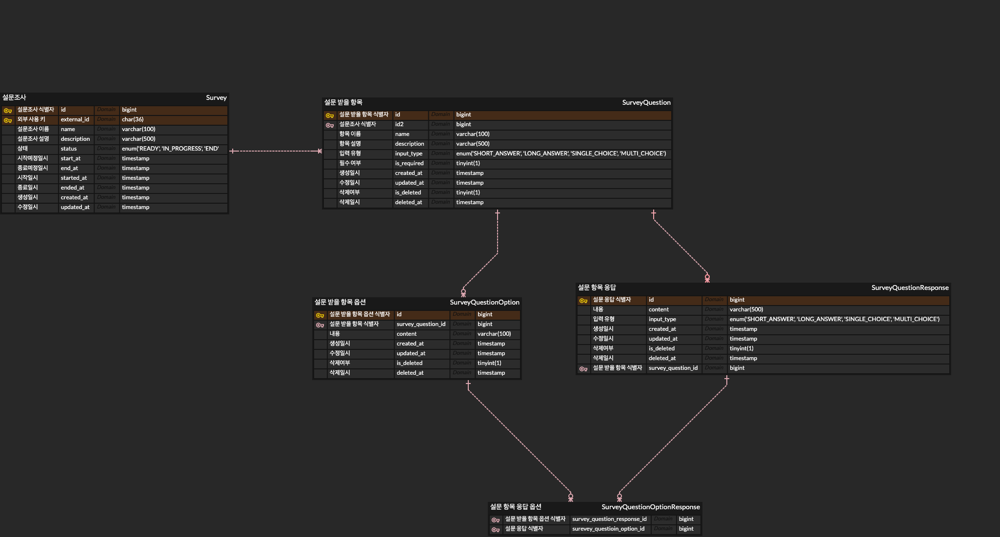

### 온보딩 프로젝트
개요
“설문조사 서비스”는 설문조사 양식을 만들고, 만들어진 양식을 기반으로 응답을 받을 수 있는 서비스입니다. (e.g. Google Forms, Tally, Typeform)
설문조사 양식은 [설문조사 이름], [설문조사 설명], [설문 받을 항목]의 구성으로 이루어져있습니다.
[설문 받을 항목]은 [항목 이름], [항목 설명], [항목 입력 형태], [항목 필수 여부]의 구성으로 이루어져있습니다.
[항목 입력 형태]는 [단답형], [장문형], [단일 선택 리스트], [다중 선택 리스트]의 구성으로 이루어져있습니다.

### 프로젝트 구조
```
📦 project-root
├── 📂 domain
│   ├── 📂 entity
│   │   ├── Survey.java
│   │   └── SurveyResponse.java
│   ├── 📂 repository
│   │   ├── SurveyRepository.java
│   │   └── SurveyResponseRepository.java
│   ├── 📂 query
│   │   ├── 📂 dto
│   │   │   ├── SurveyQuery.java
│   │   │   └── SurveyResponseQuery.java
│   │   └── 📂 service
│   │       ├── SurveyQueryService.java
│   │       └── SurveyResponseQueryService.java
│   └── 📂 command
│       ├── 📂 dto
│       │   ├── SurveyCommand.java
│       │   └── SurveyResponseCommand.java
│       └── 📂 service
│           ├── SurveyCommandService.java
│           └── SurveyResponseCommandService.java
│
├── 📂 application
│   ├── 📂 controller
│   │   ├── 📂 request
│   │   │   ├── CreateSurveyRequest.java
│   │   │   ├── UpdateSurveyRequest.java
│   │   │   ├── SubmitSurveyResponseRequest.java
│   │   │   └── SurveyResponseQueryRequest.java
│   │   ├── 📂 response
│   │   │   ├── SurveyResponse.java
│   │   │   ├── SurveyListResponse.java
│   │   │   └── SurveyResponseResponse.java
│   │   ├── SurveyController.java
│   │   └── SurveyResponseController.java
│   └── 📂 service
│       ├── 📂 dto
│       │   ├── SurveyDto.java
│       │   └── SurveyResponseDto.java
│       ├── SurveyService.java
│       └── SurveyResponseService.java
```

### 추가 사용 라이브러리

[rest-assured](https://github.com/rest-assured/rest-assured)
- BDD 스타일의 API 테스트를 위한 라이브러리로 E2E 테스트를 위해 추가하였습니다. given/when/then 구문을 사용한 메서드 체이닝 방식으로 가독성이 좋은 장점이 있습니다.
- 해당 라이브러리는 E2E뿐 아니라 Unit Test에서도 사용할 수 있고 BDD 스타일 구문을 활용하기 때문에 API 테스트를 위한 학습 곡선이 낮다고 판단하였습니다.

### ERD
