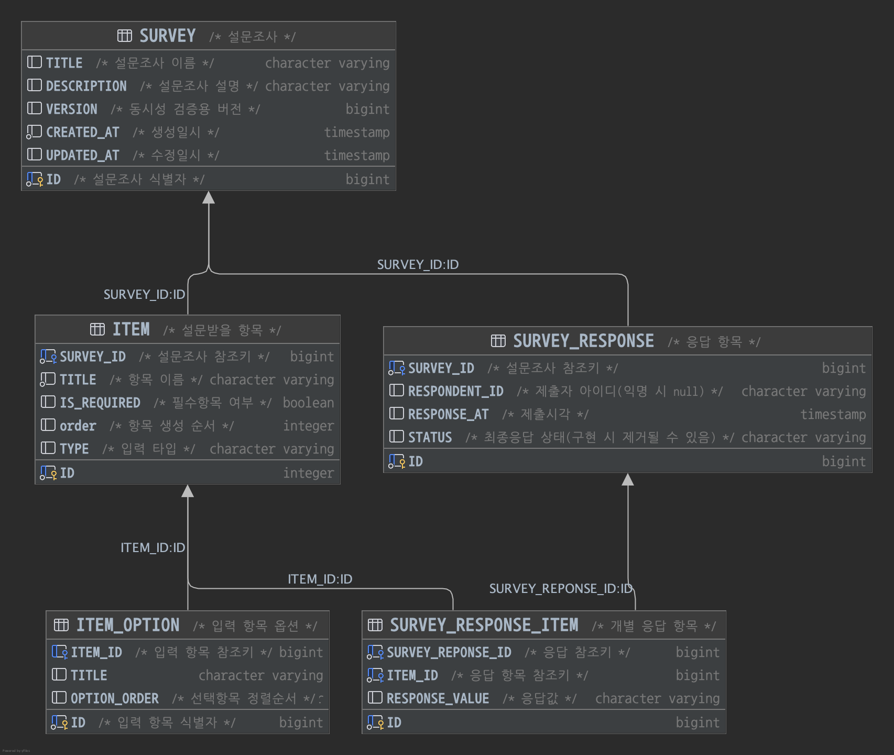

# Survey Service
## 1. 개요
* 양식(form)을 생성하고, 생성된 양식 기반의 응답을 받을 수 있는 서비스를 구현한다.
* 다음과 같은 서비스를 참고할 수 있다. Google Forms. Tally, TypeForm

## 2. 엔드포인트
* 구현해야 할 엔드포인트는 다음과 같다
```text
POST /v1/survey
PATCH /v1/survey/{survey_id}
POST /v1/survey/{survey_id}/response
GET /v1/survey/{survey_id}
```
## 3. 검증
### 1. 권한
1. 양식에 대한 접근 권한
2. 설문 제출에 대한 권한
### 2. 항목
1. 데이터 길이
2. 필수값 여부
3. 개수 제한
4. 설문 만료일
5. 항목 최대/최소 선택 가능 옵션 수
### 3. 응답
1. 중복 제출(따닥)
2. 유효한 양식 여부
3. [설문 받을 항목]과 일치 여부
### 4. 동시성
1. 동일 계정으로 동시에 제출
2. 동시 수정 시 alert 등 처리를 고려한 DB 락 처리?  
   (=> 동시성 보다는 무결성/사용자 경험측에 포커스를 두어 구현 후 추가 고민)
## 4. API
### 설문조사 생성 POST /v1/survey
#### RequestBody
```json
{
    "title": "설문조사 이름",
    "description": "설문조사 설명",
    "question": Question
}
```
### 설문조사 수정 PATCH /v1/survey/{survey_id}
#### RequestBody
* 설문조사 특성상 모든 데이터를 다시 제출하는 것보다는, 일부  수정이 많으므로 PATCH 메소드를 구현한다
* 기존 응답이 유지되어야 하므로, 변경된 폼이 아닌 제출 당시의 데이터가 중요하다. (응답한 결과를 스냅샷과 같이 텍스트로 저장하는 것도 고려)
```json
{
  "title": "수정된 설문조사 이름",
  "description": "수정된 설문조사 설명",
  "questions": [
    {
      "id": "설문 아이디",
      "title": "항목이름",
      "description": "항목설명",
      "type": FormField,
      "is_required": "항목 필수 여부"
    }
  ]
}
```
### 설문조사 응답 제출 API
#### RequestBody
```json
{
    "respondentId": "응답자 ID (익명인 경우 null?)",
    "answers": [
        {
            "questionId": "응답 아이디",
            "value": "응답 값 (단답형, 장문형인 경우)",
            "selections": ["항목 아이디 리스트(선택형인 경우)"]
        }
    ]
}
```
### 설문조사 응답 조회 API
_*반환 데이터를 설계하다보니 FormField에 대한 고민이 더 필요함*_
```json
{
    "title": "설문조사 이름",
    "description": "설문조사 설명",
    "question": [
      {
        "title": "질문1",
        "description": "질문1 설명",
        "type": {
          "fieldName": "1번",
          
        },
        "is_required": true
      }
    ]
}
```

## 5. Type 설계
### Question(설문 받을 항목, Min = 1, Max = 10)
```json
{
    "title": "항목이름",
    "description": "항목설명", 
    "type": FormField, 
    "is_required": "항목 필수 여부"
}
```
### FormField(항목 입력 형태)
```java
public enum InputType {
    SHORT_ANSWER,
    LONG_ANSWER,
    SINGLE_SELECT,
    MULTI_SELECT
}
```
```java
public class FormField {
    private String fieldName;
    private InputType inputType;
    private List<String> selections;  // 리스트용 후보 옵션들
    
    // 선택 리스트인 경우에만 선택 옵션 추가 가능하도록 메서드 제공
    // 무조건 list or 타입에 따라 받는 것 고민
    public void addSelectionChoices(List<String> choices) {
        if (inputType == InputType.SINGLE_SELECT || inputType == InputType.MULTI_SELECT) {
            this.selectionChoices = choices;
        }
    }
}
```

## 추가 고려사항
1. 익명/실명이 존재할 수 있을 것 같다.

## ERD
* 스키마에 도메인이 설명되므로 관계 테이블에만 해당 도메인의 접두어를 명시한다
* `order`와 같이 `h2`의 예약어인 경우만 접두어를 붙인다 



# Ref

---

## ktlint
* 코틀린 공식 문서에는 기본 Coding convention 가이드를 제공한다.
* 일반적으로 핀터레스트에서 개발한 ktlint를 많이 사용한다
### 설치 및 설정
1. Gradle 플러그인 추가:
```shell
plugins {
    ...
    id("org.jlleitschuh.gradle.ktlint").version("12.1.1")
    ...
}
Apply


```
2. 플러그인 설치 후 build를 수행하면 로컬 설정에 따라 에러가 발생할 수 있다.

3. 아래 명령어로 lint 설정에 맞도록 자동 수정할 수 있다
```shell
./gradlew ktlintFormat
```
4. 적용하고자 하는 lint 설정은 root 경로의 `.editconfig` 파일에서 진행할 수 있다. ([ref](https://github.com/pinterest/ktlint/blob/master/.editorconfig))

### 커스터마이징:
.editorconfig 파일에서 원하는 규칙을 추가하거나 비활성화할 수 있다.
```
root = true

[*]
charset=utf-8
end_of_line=lf
indent_style=space
indent_size=4
insert_final_newline=true
disabled_rules=no-wildcard-imports,import-ordering,comment-spacing

[*.{kt,kts}]
insert_final_newline=false
```
### Git hooks
* 커밋 전 자동으로 ktlint 검사를 실행하도록 설정할 수 있다.
```shell
./gradlew addKtlintCheckGitPreCommitHook
```
### Plugin
* IntelliJ IDEAo에서 ktlint 플러그인으로 실시간 lint 검사가 가능하다.