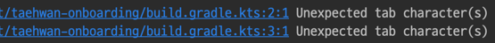

## ERD
* 스키마에 도메인이 설명되므로 관계 테이블에만 해당 도메인의 접두어를 명시한다
* `order`와 같이 `h2`의 예약어인 경우만 접두어를 붙인다 


# Ref

---

## ktlint
* 코틀린 공식 문서에는 기본 Coding convention 가이드를 제공한다.
* 일반적으로 핀터레스트에서 개발한 ktlint를 많이 사용한다
### 설치 및 설정
1. Gradle 플러그인 추가:
```shell
plugins {
    ...
    id("org.jlleitschuh.gradle.ktlint").version("12.1.1")
    ...
}
Apply


```
2. 플러그인 설치 후 build를 수행하면 로컬 설정에 따라 에러가 발생할 수 있다.

3. 아래 명령어로 lint 설정에 맞도록 자동 수정할 수 있다
```shell
./gradlew ktlintFormat
```
4. 적용하고자 하는 lint 설정은 root 경로의 `.editconfig` 파일에서 진행할 수 있다. ([ref](https://github.com/pinterest/ktlint/blob/master/.editorconfig))

### 커스터마이징:
.editorconfig 파일에서 원하는 규칙을 추가하거나 비활성화할 수 있다.
```
root = true

[*]
charset=utf-8
end_of_line=lf
indent_style=space
indent_size=4
insert_final_newline=true
disabled_rules=no-wildcard-imports,import-ordering,comment-spacing

[*.{kt,kts}]
insert_final_newline=false
```
### Git hooks
* 커밋 전 자동으로 ktlint 검사를 실행하도록 설정할 수 있다.
```shell
./gradlew addKtlintCheckGitPreCommitHook
```
### Plugin
* IntelliJ IDEAo에서 ktlint 플러그인으로 실시간 lint 검사가 가능하다.